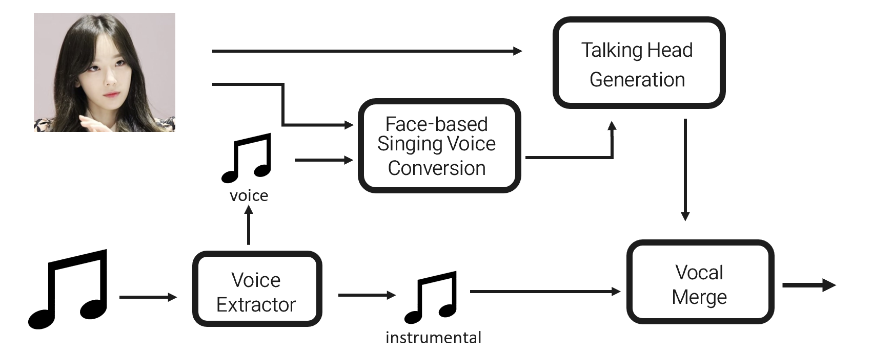
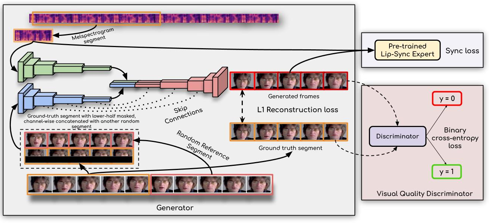
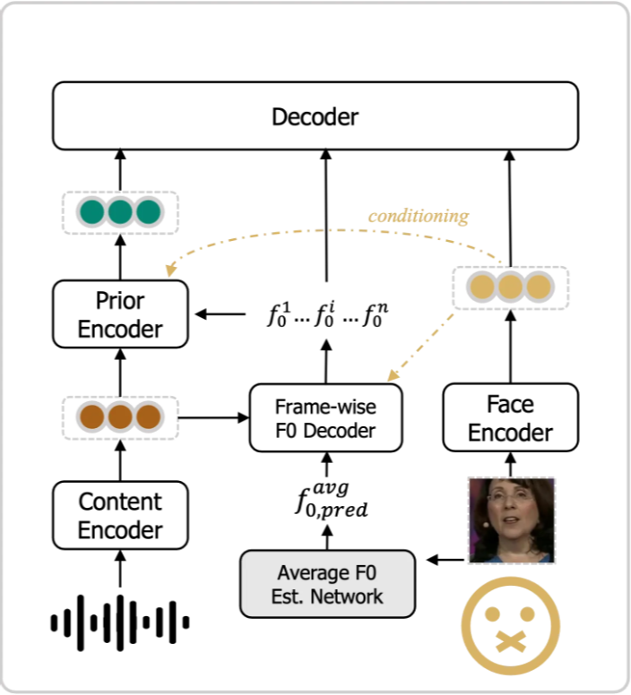
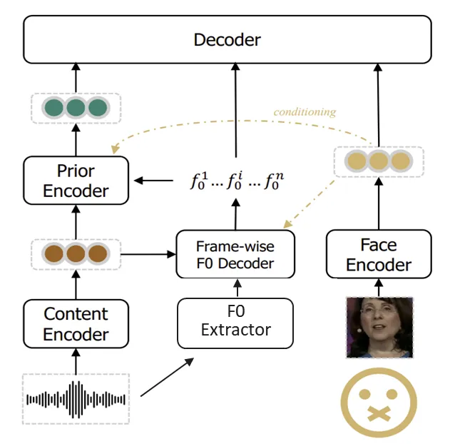

# 프로젝트명

📢 2025년 1학기 [AIKU](https://github.com/AIKU-Official) 활동으로 진행한 프로젝트입니다

## 소개

> “당신의 얼굴로 아바타 가수 제작을 해드립니다.”

SNS를 보다 보면, 연예인이나 가상 인물의 립싱크 영상을 쉽게 찾아볼 수 있습니다. 그런 영상을 보며 한 번쯤 이런 생각, 해보신 적 있지 않나요?

*"나도 내 얼굴로 가수처럼 멋지게 노래하는 영상을 만들어보고 싶다."
"내가 주인공인 아바타 가수가 있다면 어떨까?"*

하지만 기존 립싱크 AI 콘텐츠는 직접 음성을 녹음하거나, 얼굴 영상과 음성 데이터를 수집해야 하는 불편함이 따릅니다. 또한 진짜 ‘나 같은 가수’를 만들기 위해서는 ‘내 목소리’보다 ‘나에게 어울리는 목소리’가 필요합니다. 대부분의 사람은 노래를 잘하지 않기에, 내 목소리로 립싱크 영상을 만들면 오히려 어색하거나 만족도가 떨어질 수 있기 때문입니다. 이에 저희는, 얼굴에 최적화된 목소리를 AI가 찾아주고, 그 목소리로 노래하는 립싱크 영상을 제작해보기로 했습니다.

‘내가 가수가 될 상인가’는 사용자의 얼굴 사진 1장만으로 어울리는 보컬 스타일을 AI가 판단하고, 해당 목소리로 노래를 합성한 뒤, 립싱크 영상까지 완성해주는 end-to-end 가상 아바타 가수 생성 프로젝트입니다. 사용자가 직접 노래하지 않아도, 목소리를 녹음하지 않아도, '진짜 나 같은 가수'를 체험할 수 있게 하고자 합니다.

## 방법론

### PIPELINE


**Input**

- a.jpg (목표 발화자의 단일 얼굴 사진)
- song.wav(mp3) (목표 노래 음성)

**Process**

- Wav2LIP :  jpg + wav(mp3) → talking_head.mp4
- Modified HYFace : jpg + wav(mp3) → converted_song.wav

**Output**

- talking_head.mp3 + converted_song.wav → result_video.mp4

최종적으로, 하나의 명령어로 전체 파이프라인이 실행될 수 있도록 구성하였습니다. 

### Taking Head Generation - Wav2Lip

*사진 기반 립싱크 비디오 생성*

**Wav2Lip**은 음성 오디오와 얼굴 이미지를 받아, 입 모양이 정밀하게 맞는 립싱크 비디오를 생성하는 모델입니다. 기본 구조는 다음과 같습니다. 



출처: https://arxiv.org/abs/2008.10010

1. Face Encoder로부터 프레임별 얼굴 특성 추출
2. Audio Encoder로부터 음성 특성 추출
3. 이 둘을 Fusion하여 최종 립싱크 디코딩 수행

### Face-based Voice Converison - HYFace

*Face-to-Voice - 얼굴 기반 음성 생성*

기존 HYface는 입력된 얼굴 이미지로부터 해당 인물의 voice identity를 추정하고, 이 임베딩 정보를 바탕으로 voice conversion을 수행하는 **Face-to-Voice** 모델입니다. 기본 구조는 다음과 같습니다.


출처: https://www.arxiv.org/abs/2408.09802

1. **Sub Model**: 얼굴 이미지로부터 average F₀ (음높이 평균) 추정
2. **Main Model**: content 정보(ContentVec), 평균 F₀, 얼굴 기반 speaker embedding을 조합해 최종 waveform 생성

하지만, 이는 단순 음성 생성 모델로, `“노래의 다양한 피치 변화를  표현할 수 없다”`는 한계를 지녔습니다. 

저희는 음성 변환에서 그치는 것이 아니라, 변환된 음성으로 노래 음성 생성을 목표로 했기에, 기존 `Face-to-Voice` 모델인 HYFace를 `Singing Voice Conversion 모델로 확장`하는 수정을 거쳤습니다. 

### Modified HYFace : SVC

*Face-based Singing Voice Conversion*

아래는 face-to-voice 구조의 HYFace에 singing voice conversion 기능을 추가하는 구조 수정 전략입니다. 


**기존 HYFace 구조의 문제**

 기존 HYFace는 얼굴 이미지로부터 average F₀를 추정하고, 해당 값을 기반으로 음성의 pitch contour를 복원하는 방식으로 작동합니다. 하지만 이 방식은 시간적으로 정적인 평균값만을 이용하여, 넓은 F₀ 범위와 높은 시간적 변화를 다루기에 부적절했습니다. 

**즉, average F₀로는 노래의 pitch contour를 반영할 수 없습니다.** 

**수정 방안**

 기존의 평균 F₀ 예측기를 제거하고, **RMVPE(Robust Multi-View Pitch Estimation)를 도입**하였습니다. RMVPE는, 입력 음성에서 정확한 frame-level F₀를 추출할 수 있는 최신 음높이 추정기입니다. 

 이를 통해, 노래와 같이 복잡한 pitch 변화를 가진 오디오에서도 **고해상도 pitch contour**를 frame-level로 추출할 수 있게 되었습니다. 

**수정 Framework 요약**

| **항목** | **HYFace** | **Modified HYFace (SVC)** |
| --- | --- | --- |
| Pitch 표현 | 평균값 (average F₀) | Frame-level pitch (RMVPE) |
| 표현력 | 낮음 (노래 표현 어려움) | 높음 (노래 pitch 반영 가능) |
| Sub 모델 필요 여부 | 필수 | 제거 가능 |
| 화자 identity 반영 방식 | 얼굴 → speaker embedding | 동일 (identity 보존) |
| Target output | 일반적인 말소리 | 노래 형태의 voice |

## 환경 설정

```
conda create -n singer
conda activate singer
pip install -r requirements.txt
```

## 사용 방법
### HYFace Weight
따로 연락주세요
### Wav2Lip
Wav2Lip/checkpoints 안에 넣기  [Link](https://drive.google.com/file/d/15G3U08c8xsCkOqQxE38Z2XXDnPcOptNk/view)

### 데모 페이지 실행
```
python3 app.py
```

## 예시 결과

(사용 방법을 실행했을 때 나타나는 결과나 시각화 이미지를 보여주세요)

## 팀원
  | 팀원                            | 역할                                       |
| ----------------------------- | ---------------------------------------- |
| [조윤지](https://github.com/robosun78) |    데모 제작, 파이프라인   |
| [고건영](https://github.com/koheon2)     |    모델 수정    |
| [박찬우](https://github.com/onff02)        |    평가 데이터 수집   |
| [신명경](https://github.com/w-shin1112)        |    평가 코드 작성   |

